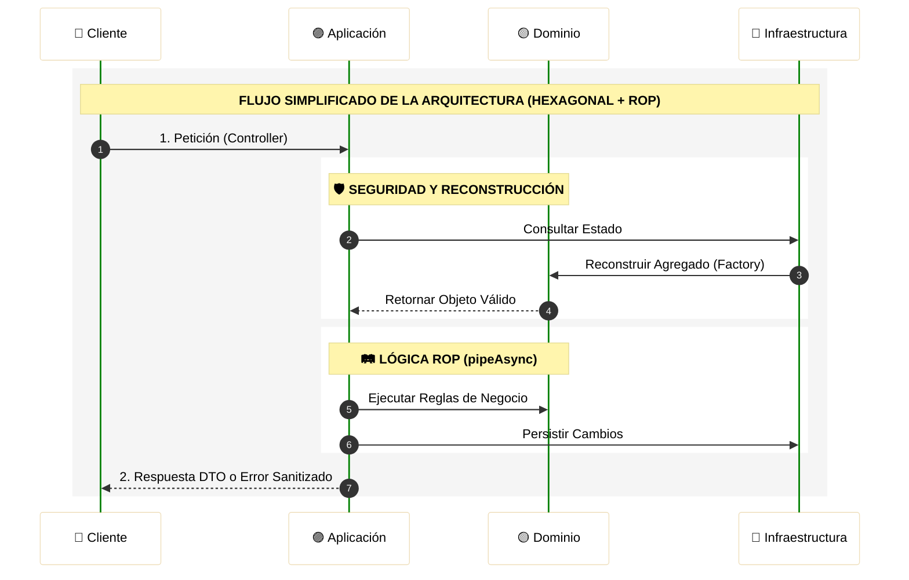

# Kahoot Clone Backend - NestJS 🚀

<p align="center">
  <a href="http://nestjs.com/" target="blank">
    
  </a>
</p>

<p align="center">
  
  
  
</p>

<p align="center">
  
  
  
  
</p>

<p align="center">
  
  
  
  
</p>

<p align="center">
  
  
</p>

---

<div align="center">

## 🛠️ Stack Tecnológico

| Categoría | Tecnologías Utilizadas |
| :--- | :--- |
| **Framework Core** | **NestJS** (Node.js) con **TypeScript** |
| **Comunicación Real-time** | **Socket.io** (WebSockets) |
| **Notificaciones Push** | **Firebase Cloud Messaging** (FCM) |
| **Persistencia (Cloud)** | **Supabase** (PostgreSQL) & **MongoDB Atlas** |
| **Persistencia (Local)** | **PostgreSQL** & **MongoDB** (Docker Containers) |
| **Gestión de Media** | **Cloudinary** (CDN & Storage) |
| **Infraestructura** | **Docker** & **Docker Compose** |
| **Logging** | **PinoLogger** |
| **Testing** | **Jest** |

</div>

---

## Configuración del Proyecto 🛠️

```bash
yarn install
```

## Compilar y ejecutar en modo desarrollador 🧠

### Configurar Variables de Entorno
1. Crea una copia del archivo `.env.template` y renómbralo a `.env`.
2. Configura las variables para establecer la conexión con la base de datos elegida (PostgreSQL o MongoDB).
3. Importante: Si utilizas un cluster de MongoDB Atlas, coloca la URL en la variable `MONGO_CNN`.

### Levantar Bases de Datos (Docker)

**PostgreSQL**
```bash
docker compose -f docker-compose.dev.postgres.yaml up -d
```

**MongoDB**
```bash
docker compose -f docker-compose.dev.mongo.yaml up -d
```

### Ejecutar el Proyecto

```bash
# development mode (watch)
yarn run start:dev

# production mode
yarn start:prod
```

## 🚀 Ejecución del Backend con Docker Compose

1. Configurar entorno:
   - `MONGO_HOST=mongo`
   - `DB_HOST=postgres`

2. Levantar servicios:

**MongoDB**
```bash
docker compose -f docker-compose.local.mongo.yaml up -d
```

**PostgreSQL**
```bash
docker compose -f docker-compose.local.postgres.yaml up -d
```

3. Acceso:
- HTTP API: http://localhost:3000/api
- WebSockets: ws://localhost:3000/multiplayer-sessions

## 🪛 Correr Tests

```bash
yarn run test        # Unit tests
yarn run test:e2e    # E2E tests
yarn run test:cov    # Coverage
```

## 🏗️ Arquitectura y Diseño

El backend está estructurado siguiendo Arquitectura Hexagonal (Ports & Adapters) y Domain-Driven Design (DDD).
Cada módulo representa su propio hexágono, fomentando la separación de responsabilidades.

---

### 🗺️ Modelo de Dominio

Para una comprensión visual profunda de las entidades, agregados y sus relaciones, disponemos de una representación gráfica detallada:

> [!TIP]
> 🎨 **[Acceder al Diagrama del Modelo de Dominio](https://lucid.app/lucidchart/ece44902-e188-405b-98a2-99114bfce612/edit?invitationId=inv_5ebb1b27-3046-48d7-bb6f-ddbeccdac5bc&page=5WW8gG8tv4Q4#)**
> _Plataforma: LucidChart_

---


### Estructura de Capas por Módulo

🟡 Domain (Núcleo)
- entities
- value-objects
- aggregates
- domain-services
- repositories 

🟣 Application
- command
- query
- application-services
- dtos

🔵 Infrastructure
- nest-js (controllers, gateways)
- external-services
- repositories (Mongoose / TypeORM)

## 🚨 Arquitectura de Errores y Eficiencia en el Motor V8

La implementación de **Railway Oriented Programming (ROP)** mediante el uso de `Either<L, R>` y `pipeAsync` proporciona beneficios críticos en la optimización del tiempo de ejecución y el aprovechamiento del motor **V8**:

### 1. Optimización del Compilador (Monomorfismo)
El motor V8 utiliza "Hidden Classes" e "Inline Caching" para optimizar el acceso a objetos. Al garantizar que todos los resultados de las funciones tengan una estructura consistente y predecible (`Either`), el sistema facilita que el compilador **JIT (Just-In-Time)** mantenga el código en su "vía rápida" (Hot Path), alcanzando velocidades de ejecución cercanas al código nativo al evitar la desoptimización por cambios de forma en los objetos de retorno.

### 2. Instanciación vs. Lanzamiento de Excepciones
Existe una diferencia fundamental en el consumo de recursos entre retornar un valor y lanzar una excepción:

- **Costo de la Excepción**: Cuando se ejecuta un `throw`, el motor V8 debe capturar el **Stack Trace** completo, una operación intensiva en CPU que implica inspeccionar la pila de llamadas y realizar múltiples concatenaciones de strings. Además, el proceso de **Stack Unwinding** (buscar el bloque `catch` correspondiente) interrumpe la tubería de instrucciones del procesador.

- **Eficiencia del Either**: Instanciar un objeto `Either` es una operación de asignación de memoria estándar y extremadamente ligera. Al tratar el error como un dato más, el flujo de ejecución permanece lineal. Para V8, recolectar estos objetos de vida corta en la "Young Generation" del montón (heap) es órdenes de magnitud más rápido que procesar el ciclo de vida de una excepción.

### 3. Maximización del Throughput (Short-circuit)
El mecanismo de **cortocircuito** de la utilidad `pipeAsync` optimiza el uso de recursos del sistema:

- **Gestión del Event Loop**: Al detener la ejecución al primer error, se evita la creación y el encolamiento de microtareas innecesarias en el Event Loop de Node.js.

- **Liberación de CPU**: El cese inmediato de la ejecución tras un fallo previene el consumo de ciclos de reloj en pasos posteriores (como enriquecimiento de datos o procesamiento de archivos), permitiendo al servidor gestionar un mayor volumen de peticiones concurrentes.

### 4. Continuidad del Hot Path
Los bloques `try/catch` históricamente han sido difíciles de optimizar para los compiladores JIT, limitando en ocasiones la capacidad de realizar **inlining** (insertar el código de una función dentro de otra). Al utilizar un flujo basado en retornos y condicionales simples (`if`), se facilita que el compilador realice optimizaciones avanzadas de flujo, manteniendo la ejecución en el nivel más alto de rendimiento.

> [!IMPORTANT]
> 🏗️ Ingeniería de Software de Alto Rendimiento:
> Esta arquitectura está diseñada desde la perspectiva de la ingeniería de Software, destacando por qué es la opción más escalable para un backend de alto rendimiento como lo es una app de quizzes.

---

## 📦 Componentes de la Arquitectura ROP

### 1. Clase ErrorData
La clase `ErrorData` encapsula toda la información de error de manera estructurada, proporcionando:

**Propiedades Principales**:
- `errorId`: UUID único generado con `randomUUID()` para trazabilidad
- `code`: Código de error identificativo
- `layer`: Capa del sistema donde ocurrió (`ErrorLayer`)
- `timestamp`: Fecha y hora exacta del error
- `message`: Descripción legible del error
- `stackTrace`: Stack trace del error (en desarrollo)
- `details`: Contexto técnico y de negocio (`IErrorContext`)
- `innerError`: Error original (si aplica)

**Características Avanzadas**:
- **Acumulación Contextual**: El método `setContext()` permite enriquecer progresivamente el contexto del error con información específica de cada capa.
- **Sanitización Automática**: Protección de campos sensibles del dominio y control jerárquico sobre la propiedad `operation`.
- **Regla de Operación**: Una vez que un error alcanza la capa `APPLICATION`, el nombre de la operación se vuelve inmutable, previniendo sobrescrituras incorrectas desde capas inferiores.

> [!WARNING]
> ⚠️ Seguridad en Producción:
>  Para futuras revisiones, se implementará un mecanismo basado en `process.env.NODE_ENV` que eliminará automáticamente el `stackTrace` (evitando referenciar el constructor de erro con super) en entornos de producción (`isProd === true`), manteniéndolo únicamente en desarrollo para facilitar el debugging.

**Formato de Log Estructurado**: El método `toLogString()` genera una representación visualmente clara del error con:
  - Codificación de colores por capa del sistema
  - Separadores distintivos para cada sección
  - Formato jerárquico para detalles y contexto

### 2. Clase Either<TLeft, TRight>
Implementación completa del patrón Either que sirve como contenedor de resultados:

**Estado y Acceso**:
- `isLeft()` / `isRight()`: Métodos de consulta del estado
- `getLeft()` / `getRight()`: Extracción segura de valores con validación de tipo

**Fábricas Estáticas**:
- `makeLeft()`: Crea una instancia representando un fallo (valor izquierdo)
- `makeRight()`: Crea una instancia representando un éxito (valor derecho)

**Transformaciones Sincrónicas**:
- `map()`: Transforma el valor Right manteniendo posibles Left
- `mapLeft()`: Transforma el valor Left manteniendo posibles Right
- `chain()`: Encadena operaciones que devuelven Either (validaciones secuenciales)

**Operaciones Asincrónicas**:
- `chainAsync()`: Encadena operaciones asíncronas que devuelven Promise<Either>
- `mapAsync()`: Transforma valores Right mediante promesas
- `tapChainAsync()`: Ejecuta efectos asíncronos manteniendo valores
- `tapLeftAsync()`: Ejecuta efectos solo en caso de error

**Flujos Condicionales**:
- `chainUnless()` / `chainUnlessAsync()`: Ejecuta encadenamiento solo si NO se cumple condición
- `mapUnlessAsync()`: Transforma valores solo si NO se cumple condición

**Utilidades Avanzadas**:
- `tryCatch()`: Elimina try-catch de promesas, convirtiéndolas en Either automáticamente
- `isEither()`: Type Guard para verificar instancias de Either

### 3. Función pipeAsync
Orquesta la ejecución secuencial de operaciones con mecanismo de cortocircuito:

**Características Principales**:
- **Cortocircuito Automático**: Detiene la ejecución inmediatamente al encontrar un error (valor Left)
- **Flexibilidad de Tipos**: Acepta Either o Promise<Either> como valor inicial
- **Adaptación Automática**: Detecta si un paso devuelve Either o valor plano, envolviéndolo adecuadamente
- **Pipeline Asíncrono**: Maneja automáticamente operaciones sincrónicas y asíncronas

**Flujo de Ejecución**:
1. Resolución del valor inicial (puede ser Promise)
2. Iteración secuencial por cada paso del pipeline
3. Detección automática de errores (break en el primer Left)
4. Casting final al tipo esperado de retorno

---
### 📌 DIAGRAMA DE SECUENCIA (ERRORES / ROP)
 
> El siguiente diagrama describe el flujo reducido del sistema de errores (UpdataKahootHandler)

---



---

> El siguiente diagrama describe el flujo completo de ejecución, incluyendo el manejo de errores mediante Railway Oriented Programming (UpdataKahootHandler).

---



```mermaid
%%{init: { 
  'theme': 'base', 
  'themeVariables': { 
    'actorLineColor': '#008000',
    'actorTextColor': '#000000', 
    'actorFontWeight': '900', 
    'noteTextColor': '#000000', 
    'noteFontWeight': '900', 
    'signalTextColor': '#000000', 
    'signalFontWeight': '900',
    'signalColor': '#000000'
  }
}}%%
sequenceDiagram
    autonumber

    %% --- PARTICIPANTES ---
    participant Client as <b><font color="black">Cliente</font></b>
    participant Ctrl as <b><font color="black">Controller</font></b>
    participant Deco as <b><font color="black">Decorator</font></b>
    participant Auth as <b><font color="black">Authorizer</font></b>
    participant Repo as <b><font color="black">Repository</font></b>
    participant Fact as <b><font color="black">Factory</font></b>
    participant Hand as <b><font color="black">Handler</font></b>
    participant Agg as <b><font color="black">Aggregate</font></b>
    participant Exec as <b><font color="black">Executor</font></b>
    participant Filt as <b><font color="black">Filter</font></b>

    Note over Ctrl: <b><font color="black">[Controller] KahootController</font></b>
    Note over Deco: <b><font color="black">[Decorator] Authorize</font></b>
    Note over Auth: <b><font color="black">[IAuthorizer] KahootOwnershipAuthorizer</font></b>
    Note over Repo: <b><font color="black">[IKahootRepository] KahootRepositoryMongo</font></b>
    Note over Fact: <b><font color="black">[DomainFactory] KahootFactory</font></b>
    Note over Hand: <b><font color="black">[ICommandHandler] UpdateKahootHandler</font></b>
    Note over Agg: <b><font color="black">[Domain] Kahoot / Value Objects</font></b>
    Note over Filt: <b><font color="black">[ExceptionFilter] AllExceptionsFilter</font></b>

    %% --- FASE 1: AUTH & RECONSTRUCTION ---
    Client->>Ctrl: <b><font color="black">PUT /kahoots/:id</font></b>
    Ctrl->>Deco: <b><font color="black">executeCommand(cmd)</font></b>

    rect rgb(243, 229, 245)
        Note right of Deco: <b><font color="black">FASE 1: SEGURIDAD (Capa Aplicacion)</font></b>
        Deco->>Auth: <b><font color="black">authorize(command, context)</font></b>

        rect rgb(227, 242, 253)
            Note right of Repo: <b><font color="black">RECONSTRUCCION DE DOMINIO (Capa Infra)</font></b>
            Auth->>Repo: <b><font color="black">findKahootByIdEither(id)</font></b>
            Repo->>Repo: <b><font color="black">mongoModel.findOne()</font></b>
            
            rect rgb(255, 250, 200)
                Note right of Fact: <b><font color="black">VALIDACION DE AGREGADO (Capa Dominio)</font></b>
                Repo->>Fact: <b><font color="black">reconstructFromSnapshot(snap)</font></b>
                Note over Fact: <b><font color="black">Revalida VOs e Invariantes</font></b>
                Fact-->>Repo: <b><font color="black">Either (Left o Right)</font></b>
            end
            Repo-->>Auth: <b><font color="black">Either (Left o Right)</font></b>
        end
        
        Note over Auth: <b><font color="black">Valida Reglas de Acceso (Ownership, Status)</font></b>
        Auth-->>Deco: <b><font color="black">Either (Left o Right)</font></b>
        
        alt <b><font color="black">isLeft (Falla Seguridad o Dominio)</font></b>
            Deco-->>Ctrl: <b><font color="black">Return Either.Left (Cortocircuito)</font></b>
        else <b><font color="black">isRight (Todo OK)</font></b>
            Deco->>Deco: <b><font color="black">command.validatedResource = kahoot</font></b>
        end
    end

    %% --- FASE 2: USE CASE (pipeAsync) ---
    rect rgb(243, 229, 245)
        Note right of Hand: <b><font color="black">FASE 2: LOGICA DE NEGOCIO (Capa Aplicacion)</font></b>
        Deco->>Hand: <b><font color="black">execute(command)</font></b>

        rect rgb(230, 242, 255)
            Note right of Hand: <b><font color="black">Bucle pipeAsync (Railway Oriented Programming)</font></b>
            
            Note over Hand: <b><font color="black">Paso 1: Mutacion de Dominio</font></b>
            Hand->>Agg: <b><font color="black">applyUpdates()</font></b>
            Agg-->>Hand: <b><font color="black">Either.Right(kahoot)</font></b>

            rect rgb(255, 235, 235)
                Note over Hand: <b><font color="black">Paso 2: Persistencia (Simulacion de Fallo)</font></b>
                Hand->>Repo: <b><font color="black">saveKahootEither(kahoot)</font></b>
                Repo-->>Hand: <b><font color="black">Either.Left(ErrorData INFRA)</font></b>
                
                Note over Hand: <b><font color="black">CORTOCIRCUITO: pipeAsync detecta Left</font></b>
                Note over Hand: <b><font color="black">break loop (Se detiene el tren)</font></b>
            end
        end

        Hand->>Hand: <b><font color="black">err.setContext(appContext)</font></b>
        Note over Hand: <b><font color="black">Agrega ActorId y Operacion al ErrorData</font></b>
        Hand-->>Deco: <b><font color="black">Return Either.Left(ErrorData)</font></b>
    end

    Deco-->>Ctrl: <b><font color="black">Propaga Either.Left</font></b>

    %% --- FASE 3: BRIDGE & FILTER ---
    rect rgb(227, 242, 253)
        Note right of Exec: <b><font color="black">EXCEPTION BRIDGE (Puente a NestJS)</font></b>
        Ctrl->>Exec: <b><font color="black">throwResult(result)</font></b>
        Note over Exec: <b><font color="black">result.isLeft -> throw ErrorData</font></b>
        Exec-->>Filt: <b><font color="black">Lanza Excepcion para AllExceptionsFilter</font></b>

        Note right of Filt: <b><font color="black">FILTRO GLOBAL (Capa Infra)</font></b>
        Filt->>Filt: <b><font color="black">logger.error(toLogString)</font></b>
        Note over Filt: <b><font color="black">Log visual detallado con StackTrace</font></b>
        Filt->>Filt: <b><font color="black">sanitizeDetails(error)</font></b>
        Note over Filt: <b><font color="black">Oculta DB e Infra si es un error critico</font></b>
        Filt-->>Client: <b><font color="black">HTTP Response (JSON IErrorResponse)</font></b>
    end
```

###
### 🔗 RECURSOS EXTERNOS PARA LOS ERRORES
Para una experiencia visual mejorada y acceso a la edición del diagrama, utiliza el siguiente enlace:

> 🎨 **[Acceder al Diagrama en Eraser.io](https://app.eraser.io/workspace/w9byiD8Kuq4CRJ47rOU8?origin=share)**

---

## 📁 Guía de Directorios


### ⚛️ src/core

| Capa | Responsabilidad |
| :--- | :--- |
| **`domain/`** | **Núcleo de Negocio**: Abstracciones base (`AggregateRoot`, `Entity`, `ValueObject`), Eventos de Dominio y objetos de valor compartidos (IDs, fechas, puntos). |
| **`application/`** | **Puertos y Orquestación**: Definición de contratos (`ports`), lógica de seguridad (`auth`), decoradores de autorización y la interfaz del Bus de CQRS. |
| **`infrastructure/`** | **Implementaciones Técnicas**: Adaptadores reales para criptografía, generación de IDs (UUID), y la implementación física de los buses (Memory/Pino). |
| **`errors/`** | **Gestión de Fallos (ROP)**: Sistema centralizado de errores con factorías, contextos y el `pipe-async` para composición de flujos. |
| **`types/`** | **Tipado Funcional**: Tipos base para el control de flujo como `Either.ts` (éxito/error) y `Optional.ts`. |
| **`nest-js/`** | **Integración**: Decoradores y controladores base específicos para el ciclo de vida de NestJS. |

### 🧩 Anatomía de un Módulo (`src/[modulo]`)

Cada módulo sigue su propio hexágono, asegurando que la lógica de negocio no dependa de la tecnología externa.

| Capa | Contenido | Objetivo |
| :--- | :--- | :--- |
| **`domain/`** | Entidades, Agregados, Repositorios (Interfaces) | Definir las reglas de negocio puras del módulo. |
| **`application/`** | Casos de Uso, Command/Query Handlers, DTOs | Orquestar la lógica y transformar datos de entrada. |
| **`infrastructure/`** | Controladores, Adaptadores de BD, Mappers | Implementar la comunicación con el mundo exterior. |

---

### 🗄️ Capa de Datos (`src/database`)

Diseñada para ser agnóstica al motor de persistencia, permitiendo alta escalabilidad y flexibilidad.

| Componente | Funcionalidad |
| :--- | :--- |
| **Configuración** | Gestión de conexiones para **TypeORM** y **Mongoose**. |
| **Intercambio Dinámico** | Capacidad de conmutar entre motores de BD (SQL/NoSQL) según el entorno o necesidad. |
| **Patrón Repositorio** | Implementaciones concretas que desacoplan el dominio de la base de datos elegida. |

---

### 🔗 Documentación de Referencia
> [!IMPORTANT]
> **Especificación de API Endpoints**
> Para profundizar en los endpoints, requests y response de la app:
>
> 📂 **Acceso al Documento:** [Especificación de API](https://docs.google.com/document/d/1wopz-IhqVTCTEU9TGHClAUCmHJ8dOp4M2ZBwvzwADrQ/edit?usp=sharing)

---


---
## ⚖️ License

This project is licensed under the MIT License - see the [LICENSE](LICENSE) file for details.

Copyright (c) 2025 Gustavo Kufatty, Luis Monroy, Luis Ochoa, Franklin Quintana, Sergio Rodríguez, Santiago Silva.
