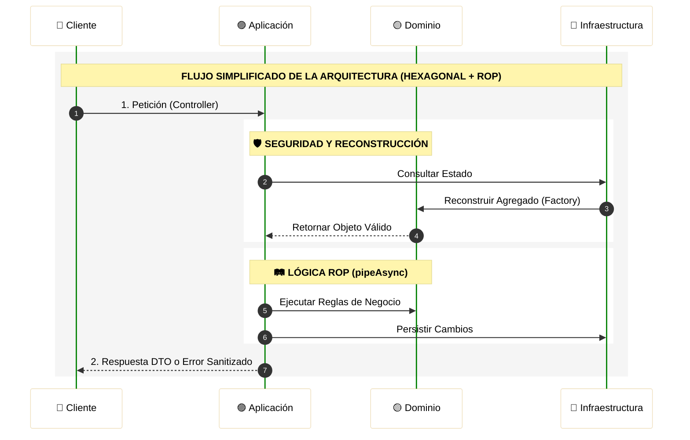
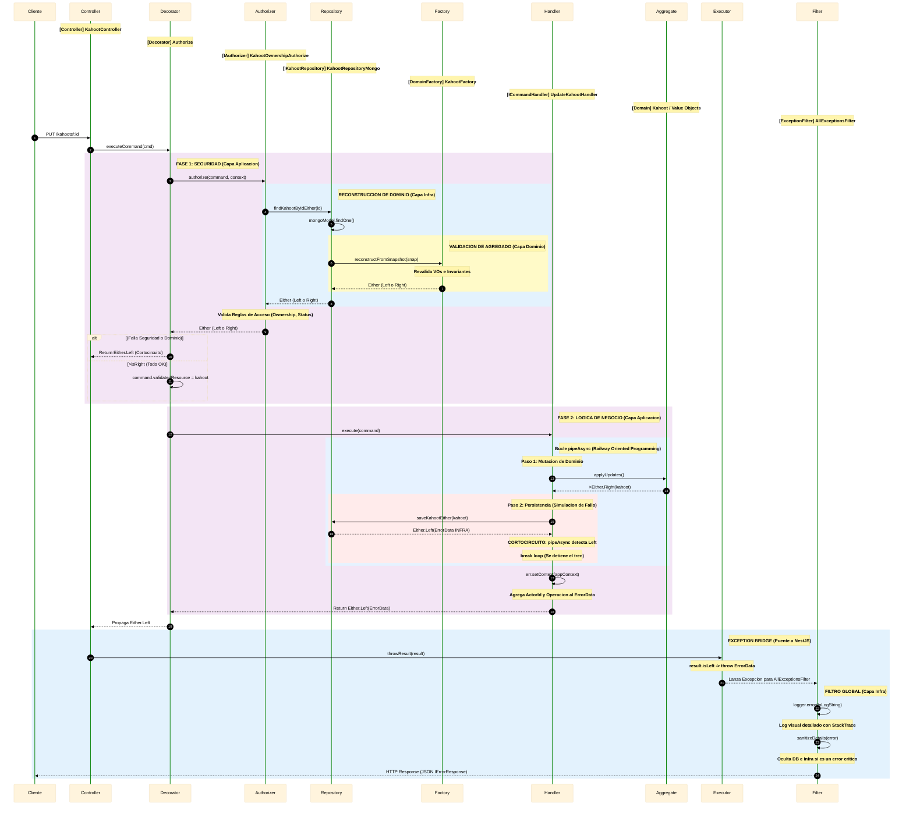
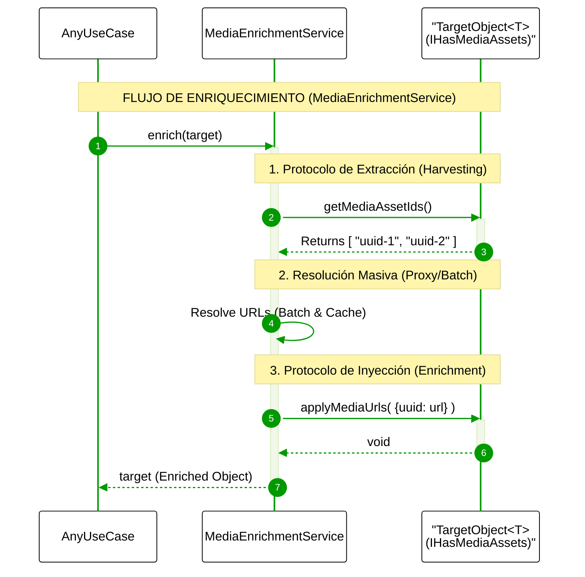
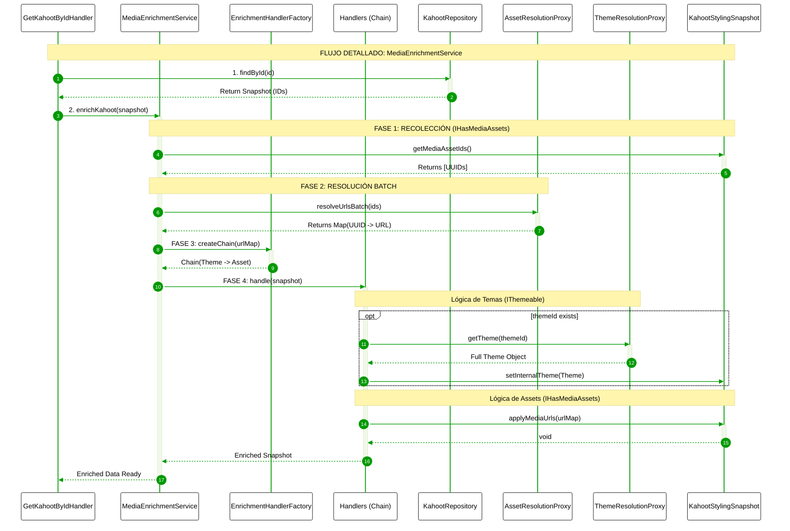

# Kahoot Clone Backend - NestJS 🚀

<p align="center">
  <a href="http://nestjs.com/" target="blank">
    
  </a>
</p>

<p align="center">
  
  
  
</p>

<p align="center">
  
  
  
  
</p>

<p align="center">
  
  
  
  
</p>

<p align="center">
  
  
</p>

---

<div align="center">

## 🛠️ Stack Tecnológico

| Categoría | Tecnologías Utilizadas |
| :--- | :--- |
| **Framework Core** | **NestJS** (Node.js) con **TypeScript** |
| **Comunicación Real-time** | **Socket.io** (WebSockets) |
| **Notificaciones Push** | **Firebase Cloud Messaging** (FCM) |
| **Persistencia (Cloud)** | **Supabase** (PostgreSQL) & **MongoDB Atlas** |
| **Persistencia (Local)** | **PostgreSQL** & **MongoDB** (Docker Containers) |
| **Gestión de Media** | **Cloudinary** (CDN & Storage) |
| **Infraestructura** | **Docker** & **Docker Compose** |
| **Logging** | **PinoLogger** |
| **Testing** | **Jest** |

</div>

---

## Configuración del Proyecto 🛠️

```bash
yarn install
```

## Compilar y ejecutar en modo desarrollador 🧠

### Configurar Variables de Entorno
1. Crea una copia del archivo `.env.template` y renómbralo a `.env`.
2. Configura las variables para establecer la conexión con la base de datos elegida (PostgreSQL o MongoDB).
3. Importante: Si utilizas un cluster de MongoDB Atlas, coloca la URL en la variable `MONGO_CNN`.

### Levantar Bases de Datos (Docker)

**PostgreSQL**
```bash
docker compose -f docker-compose.dev.postgres.yaml up -d
```

**MongoDB**
```bash
docker compose -f docker-compose.dev.mongo.yaml up -d
```

### Ejecutar el Proyecto

```bash
# development mode (watch)
yarn run start:dev

# production mode
yarn start:prod
```

## 🚀 Ejecución del Backend con Docker Compose

1. Configurar entorno:
   - `MONGO_HOST=mongo`
   - `DB_HOST=postgres`

2. Levantar servicios:

**MongoDB**
```bash
docker compose -f docker-compose.local.mongo.yaml up -d
```

**PostgreSQL**
```bash
docker compose -f docker-compose.local.postgres.yaml up -d
```

3. Acceso:
- HTTP API: http://localhost:3000/api
- WebSockets: ws://localhost:3000/multiplayer-sessions

## 🪛 Correr Tests

```bash
yarn run test        # Unit tests
yarn run test:e2e    # E2E tests
yarn run test:cov    # Coverage
```

## 🏗️ Arquitectura y Diseño

El backend está estructurado siguiendo Arquitectura Hexagonal (Ports & Adapters) y Domain-Driven Design (DDD).
Cada módulo representa su propio hexágono, fomentando la separación de responsabilidades.

---

### 🗺️ Modelo de Dominio

Para una comprensión visual profunda de las entidades, agregados y sus relaciones, disponemos de una representación gráfica detallada:

> [!TIP]
> 🎨 **[Acceder al Diagrama del Modelo de Dominio](https://lucid.app/lucidchart/ece44902-e188-405b-98a2-99114bfce612/edit?invitationId=inv_5ebb1b27-3046-48d7-bb6f-ddbeccdac5bc&page=5WW8gG8tv4Q4#)**
> _Plataforma: LucidChart_

---


### Estructura de Capas por Módulo

🟡 Domain (Núcleo)
- entities
- value-objects
- aggregates
- domain-services
- repositories 

🟣 Application
- command
- query
- application-services
- dtos

🔵 Infrastructure
- nest-js (controllers, gateways)
- external-services
- repositories (Mongoose / TypeORM)

## 🚨 Arquitectura de Errores y Eficiencia en el Motor V8

La implementación de **Railway Oriented Programming (ROP)** mediante el uso de `Either<L, R>` y `pipeAsync` proporciona beneficios críticos en la optimización del tiempo de ejecución y el aprovechamiento del motor **V8**:

### 1. Optimización del Compilador (Monomorfismo)
El motor V8 utiliza "Hidden Classes" e "Inline Caching" para optimizar el acceso a objetos. Al garantizar que todos los resultados de las funciones tengan una estructura consistente y predecible (`Either`), el sistema facilita que el compilador **JIT (Just-In-Time)** mantenga el código en su "vía rápida" (Hot Path), alcanzando velocidades de ejecución cercanas al código nativo al evitar la desoptimización por cambios de forma en los objetos de retorno.

### 2. Instanciación vs. Lanzamiento de Excepciones
Existe una diferencia fundamental en el consumo de recursos entre retornar un valor y lanzar una excepción:

- **Costo de la Excepción**: Cuando se ejecuta un `throw`, el motor V8 debe capturar el **Stack Trace** completo, una operación intensiva en CPU que implica inspeccionar la pila de llamadas y realizar múltiples concatenaciones de strings. Además, el proceso de **Stack Unwinding** (buscar el bloque `catch` correspondiente) interrumpe la tubería de instrucciones del procesador.

- **Eficiencia del Either**: Instanciar un objeto `Either` es una operación de asignación de memoria estándar y extremadamente ligera. Al tratar el error como un dato más, el flujo de ejecución permanece lineal. Para V8, recolectar estos objetos de vida corta en la "Young Generation" del montón (heap) es órdenes de magnitud más rápido que procesar el ciclo de vida de una excepción.

### 3. Maximización del Throughput (Short-circuit)
El mecanismo de **cortocircuito** de la utilidad `pipeAsync` optimiza el uso de recursos del sistema:

- **Gestión del Event Loop**: Al detener la ejecución al primer error, se evita la creación y el encolamiento de microtasks innecesarias en el Event Loop de Node.js.

- **Liberación de CPU**: El cese inmediato de la ejecución tras un fallo previene el consumo de ciclos de reloj en pasos posteriores (como enriquecimiento de datos o procesamiento de archivos), permitiendo al servidor gestionar un mayor volumen de peticiones concurrentes.

### 4. Continuidad del Hot Path
Los bloques `try/catch` históricamente han sido difíciles de optimizar para los compiladores JIT, limitando en ocasiones la capacidad de realizar **inlining** (insertar el código de una función dentro de otra). Al utilizar un flujo basado en retornos y condicionales simples (`if`), se facilita que el compilador realice optimizaciones avanzadas de flujo, manteniendo la ejecución en el nivel más alto de rendimiento.

> [!IMPORTANT]
> 🏗️ Ingeniería de Software de Alto Rendimiento:
> Esta arquitectura está diseñada desde la perspectiva de la ingeniería de Software, destacando por qué es la opción más escalable para un backend de alto rendimiento como lo es una app de quizzes.

---

## 📦 Componentes de la Arquitectura ROP

### 1. Clase ErrorData
La clase `ErrorData` encapsula toda la información de error de manera estructurada, proporcionando:

**Propiedades Principales**:
- `errorId`: UUID único generado con `randomUUID()` para trazabilidad
- `code`: Código de error identificativo
- `layer`: Capa del sistema donde ocurrió (`ErrorLayer`)
- `timestamp`: Fecha y hora exacta del error
- `message`: Descripción legible del error
- `stackTrace`: Stack trace del error (en desarrollo)
- `details`: Contexto técnico y de negocio (`IErrorContext`)
- `innerError`: Error original (si aplica)

**Características Avanzadas**:
- **Acumulación Contextual**: El método `setContext()` permite enriquecer progresivamente el contexto del error con información específica de cada capa.
- **Sanitización Automática**: Protección de campos sensibles del dominio y control jerárquico sobre la propiedad `operation`.
- **Regla de Operación**: Una vez que un error alcanza la capa `APPLICATION`, el nombre de la operación se vuelve inmutable, previniendo sobrescrituras incorrectas desde capas inferiores.

> [!WARNING]
> ⚠️ Seguridad en Producción:
>  Para futuras revisiones, se implementará un mecanismo basado en `process.env.NODE_ENV` que eliminará automáticamente el `stackTrace` (evitando referenciar el constructor de error con super) en entornos de producción (`isProd === true`), manteniéndolo únicamente en desarrollo para facilitar el debugging.

**Formato de Log Estructurado**: El método `toLogString()` genera una representación visualmente clara del error con:
  - Codificación de colores por capa del sistema
  - Separadores distintivos para cada sección
  - Formato jerárquico para detalles y contexto

### 2. Clase Either<TLeft, TRight>
Implementación completa del patrón Either que sirve como contenedor de resultados:

**Estado y Acceso**:
- `isLeft()` / `isRight()`: Métodos de consulta del estado
- `getLeft()` / `getRight()`: Extracción segura de valores con validación de tipo

**Fábricas Estáticas**:
- `makeLeft()`: Crea una instancia representando un fallo (valor izquierdo)
- `makeRight()`: Crea una instancia representando un éxito (valor derecho)

**Transformaciones Sincrónicas**:
- `map()`: Transforma el valor Right manteniendo posibles Left
- `mapLeft()`: Transforma el valor Left manteniendo posibles Right
- `chain()`: Encadena operaciones que devuelven Either (validaciones secuenciales)

**Operaciones Asincrónicas**:
- `chainAsync()`: Encadena operaciones asíncronas que devuelven Promise<Either>
- `mapAsync()`: Transforma valores Right mediante promesas
- `tapChainAsync()`: Ejecuta efectos asíncronos manteniendo valores
- `tapLeftAsync()`: Ejecuta efectos solo en caso de error

**Flujos Condicionales**:
- `chainUnless()` / `chainUnlessAsync()`: Ejecuta encadenamiento solo si NO se cumple condición
- `mapUnlessAsync()`: Transforma valores solo si NO se cumple condición

**Utilidades Avanzadas**:
- `tryCatch()`: Elimina try-catch de promesas, convirtiéndolas en Either automáticamente
- `isEither()`: Type Guard para verificar instancias de Either

### 3. Función pipeAsync
Orquesta la ejecución secuencial de operaciones con mecanismo de cortocircuito:

**Características Principales**:
- **Cortocircuito Automático**: Detiene la ejecución inmediatamente al encontrar un error (valor Left)
- **Flexibilidad de Tipos**: Acepta Either o Promise<Either> como valor inicial
- **Adaptación Automática**: Detecta si un paso devuelve Either o valor plano, envolviéndolo adecuadamente
- **Pipeline Asíncrono**: Maneja automáticamente operaciones sincrónicas y asíncronas

**Flujo de Ejecución**:
1. Resolución del valor inicial (puede ser Promise)
2. Iteración secuencial por cada paso del pipeline
3. Detección automática de errores (break en el primer Left)
4. Casting final al tipo esperado de retorno

---
### 📌 DIAGRAMA DE SECUENCIA (ERRORES / ROP)
 
> El siguiente diagrama describe el flujo reducido del sistema de errores

---



---

> El siguiente diagrama describe el flujo completo de ejecución, incluyendo el manejo de errores mediante Railway Oriented Programming (UpdateKahootHandler).

---



### 🔗 RECURSOS EXTERNOS PARA LOS ERRORES
Para una experiencia visual mejorada y acceso a la edición del diagrama, utiliza el siguiente enlace:

> 🎨 **[Acceder al Diagrama en Eraser.io](https://app.eraser.io/workspace/w9byiD8Kuq4CRJ47rOU8?origin=share)**

---

# 🧩 Media Module: MediaEnrichmentService El Serivcio MVP 
### *Abstracción de Infraestructura y Enriquecimiento de Dominio*

El **Media Module**, Ademas de tener unos endpoints. Presenta el `MediaEnrichmentService` que no es solo un servicio de utilidad; es un servicio que actúa como un **cross cutting concertl**. Su existencia resuelve el conflicto entre tener un **Dominio puro** (basado en IDs y lógica de negocio) y las necesidades de una **Interfaz de Usuario** (que requiere URLs firmadas, transformaciones de imagen y metadatos).


#### 🎯 Visión y Propósito Estratégico
* **Desacoplamiento Total:** Los agregados de dominio (como `Kahoot` o `Question`) no almacenan URLs de Cloudinary. Esto evita que el dominio dependa de proveedores externos que podrían cambiar en el futuro.
* **API Unificada:** Proporciona una interfaz única donde el desarrollador no tiene que preocuparse de donde viene el recurso, siendo abstracto.
* **Optimización del Event Loop:** Al centralizar la resolución de medios, el servicio gestiona las promesas y llamadas asíncronas de forma agrupada, liberando carga al Event Loop de Node.js.

> [!IMPORTANT]
> **Filosofía de Diseño:** Consumir media debe ser una operación de "caja negra". El desarrollador entrega un ID y recibe un objeto listo para pintar en pantalla, sin conocer la complejidad técnica que ocurre detrás.

---

## 🏛️ Arquitectura Interna y Mecanismos de Eficiencia

El Servicio opera bajo una arquitectura de **Contratos de Comportamiento**. En lugar de acoplarse a clases específicas, utiliza interfaces situadas en `src/core/domain/abstractions`. Cualquier objeto que implemente estos contratos puede ser "procesado" por el Servicio.


### 🔄 El Ciclo de Vida del Enriquecimiento

1.  **Harvesting (Fase de Recolección):**
    El `MediaEnrichmentService` realiza una inspección profunda (Introspection) del objeto. Si el objeto implementa `IHasMediaAssets`, el servicio extrae todos los UUIDs. Esto permite que, incluso en objetos anidados (como un Kahoot con múltiples preguntas), se obtengan todos los requerimientos de una sola vez.

2.  **Resolution (Proxy y y FlyWeight):**
    Aquí entra en juego el **AssetResolutionProxy**. En lugar de disparar 20 peticiones HTTP, el Proxy agrupa los IDs únicos.
    * **Mecanismo Flyweight:** Si varios elementos comparten la misma imagen de portada, el Proxy solo la resuelve una vez y clona la referencia de la URL, ahorrando memoria RAM de forma masiva.
    * **Caché Transparente:** Implementa una capa de persistencia volátil que evita re-consultar bases de datos para recursos estáticos frecuentes.

3.  **Injection (Pipeline de Handlers):**
    Utilizamos una **Cadena de Responsabilidad (Chain of Responsibility)** para que el proceso sea modular.
    * **ThemeHandler:** Resuelve colores, tipografías y estilos del tema.
    * **AssetHandler:** Inyecta las URLs finales de Cloudinary en los campos correspondientes.
    * **ValidationHandler:** Asegura que los recursos resueltos sean válidos y seguros para el cliente.

### 🛠️ Patrones de Diseño 

| Patrón | Implementación Técnica | Beneficio de Ingeniería |
| :--- | :--- | :--- |
| **FACADE** | `MediaEnrichmentService` | Reduce la carga cognitiva del desarrollador al exponer un solo método `enrich()`. En caso de transoframaciones mas complejas podria requerer methods especificos |
| **FACTORY** | `EnrichmentHandlerFactory` | Encapsula el uso de la palabra reservada `new` en la facade. |
| **PROXY** | `AssetResolutionProxy` | Control de acceso y optimización de red (Batching). |
| **FLYWEIGHT** | Gestión de Instancias de URL | Minimiza el impacto en el Garbage Collector al reutilizar strings y objetos de configuración. |
| **CHAIN OF RESP.** | `EnrichmentHandlers` | Permite añadir lógica de procesamiento (ej. marcas de agua) sin tocar el código existente. |

---

## 🚀 Guía de Ingeniería para el Desarrollador

### 1. Integración en la Capa de Aplicación
El uso del MediaEnrichmentService es obligatorio antes de que cualquier dato salga de la API. Esto garantiza que el Frontend nunca reciba un ID interno de base de datos donde debería ir una imagen.

```typescript
// Ejemplo en un Handler
export class AnyHandler (Puede ser Query o Command) {
  async execute(query: queryParameterObject) {
    Persistencia: Obtenemos el Dato
    const snapshot = await this.repository.findById(query.id);
    // 2. Servicio: Transformación masiva y enriquecimiento
    // El Servicio maneja internamente la recursividad y la optimización de red
    return await this.mediaService.enrichKahoot(snapshot);
  }
}
```

---

## 🏛️ Principios SOLID

El **MediaEnrichmentService`** no es solo una utilidad, es un manifiesto de arquitectura limpia. Se han aplicado los principios **SOLID** para garantizar que el sistema sea inmune a la degradación de código a medida que el proyecto crece.

* **SRP (Single Responsibility Principle):** Cada `EnrichmentHandler` tiene una única razón para cambiar. El `AssetHandler` solo conoce la lógica de URLs, mientras que el `ThemeHandler` se especializa en estilos visuales. El servicio no es un monolito GOD Class, sino una suma de especialistas coordinados.
* **OCP (Open/Closed Principle):** El sistema está **abierto a la extensión pero cerrado a la modificación**. La lógica central del servicio nunca se toca; para añadir capacidades, simplemente se inyectan nuevos eslabones a la cadena. No bostante ver máas abajo el trade-offs.
* **LSP (Liskov Substitution Principle):** Todos los Handlers heredan de una base abstracta. El motor de orquestación trata a cualquier `VideoHandler` o `ImageHandler` como un `BaseHandler` genérico, garantizando la sustituibilidad total sin romper el flujo de ejecución.
* **ISP (Interface Segregation Principle):** En lugar de una interfaz "Gorda" de Media, fragmentamos los contratos en interfaces pequeñas: `IHasMediaAssets`, `IHasTheme` o `IHasVideo`. Los objetos de dominio solo implementan lo que realmente necesitan.
* **DIP (Dependency Inversion Principle):** El Servicio depende de abstracciones, no de implementaciones. La infraestructura (Cloudinary, MongoDB) se inyecta en tiempo de ejecución, permitiendo cambiar proveedores sin alterar la lógica de negocio.

---

## 🚀 Extensibilidad y Compromisos de Diseño

### El Camino de la Extensión (Ejemplo: Streaming Video)
Añadir soporte para un nuevo tipo de medio es un proceso lineal y seguro que no afecta a los módulos existentes:
1.  **Contrato:** Se define `IHasStreamingVideo` con el método `setVideoUrl()`.
2.  **Procesador:** Se implementa `VideoEnrichmentHandler` encapsulando la lógica del proveedor (ej. Mux o YouTube).
3.  **Registro:** Se añade al pipeline en la Factoría. Las imágenes y temas siguen funcionando sin enterarse del cambio.

### ⚖️ El Sacrificio Arquitectónico (Design Trade-offs)
En ingeniería, toda solución tiene un costo. Para lograr un **OCP** perfecto y una experiencia de desarrollo (DX) superior, hemos aceptado deliberadamente dos sacrificios:

* **Complejidad en la Facade:** La `MediaEnrichmentService` asume la responsabilidad de orquestar múltiples sub-servicios. Es el "punto caliente" de configuración, pero es el precio a pagar para que el resto de la aplicación disfrute de una simplicidad total (una sola línea de código para enriquecer).
* **Verbocidad en la Factory:** La `EnrichmentHandlerFactory` introduce un nivel adicional de indirección y código repetitivo (*boilerplate*). Sin embargo, este es el sacrificio necesario para desacoplar la **creación** de la **ejecución**, permitiendo que el sistema sea testeable y escalable.

---

## ⚡ Optimización para el Motor V8 (Node.js)

El Media Module ha sido diseñado mecánicamente para ser "amigable" con el compilador JIT de V8, maximizando el rendimiento en entornos de alta concurrencia:

* **Monomorfismo de Retorno:** Los handlers devuelven estructuras de datos con formas (*shapes*) consistentes. Esto permite que V8 optimice las **Hidden Classes** de los objetos, evitando la desoptimización del código en el "Hot Path".
* **Short-Circuiting:** Si un objeto no requiere enriquecimiento, el servicio aplica un cortocircuito inmediato. Esto evita la creación de micro-tareas y promesas innecesarias, manteniendo el **Throughput** del servidor al máximo y optimizando el uso del Event Loop.

> [!NOTE]
> El MediaEnrichmentService transforma una tarea que normalmente causaría un Dont Dry/BoilerPlate masivo en una operación de una sola línea. 

---
### 📌 DIAGRAMA DE SECUENCIA (MediaEnrichmentService)
 
> El siguiente diagrama describe el flujo reducido del servicio de enriquecimiento de media


---
> El siguiente diagrama describe el flujo completo de ejecución, del servicio).
---

---
### 🔗 RECURSOS EXTERNOS PARA EL FLUJO DEL SERVICIO DE ENRIQUECIMIENTO DE MEDIA
Para una experiencia visual mejorada y acceso a la edición del diagrama, utiliza el siguiente enlace:

> 🎨 **[Acceder al Diagrama en Eraser.io](https://app.eraser.io/workspace/fRfrRr2cxxbeY7vfT7CT?origin=share)**
---

## 📁 Guía de Directorios


### ⚛️ src/core

| Capa | Responsabilidad |
| :--- | :--- |
| **`domain/`** | **Núcleo de Negocio**: Abstracciones base (`AggregateRoot`, `Entity`, `ValueObject`), Eventos de Dominio y objetos de valor compartidos (IDs, fechas, puntos). |
| **`application/`** | **Puertos y Orquestación**: Definición de contratos (`ports`), lógica de seguridad (`auth`), decoradores de autorización y la interfaz del Bus de CQRS. |
| **`infrastructure/`** | **Implementaciones Técnicas**: Adaptadores reales para criptografía, generación de IDs (UUID), y la implementación física de los buses (Memory/Pino). |
| **`errors/`** | **Gestión de Fallos (ROP)**: Sistema centralizado de errores con factorías, contextos y el `pipe-async` para composición de flujos. |
| **`types/`** | **Tipado Funcional**: Tipos base para el control de flujo como `Either.ts` (éxito/error) y `Optional.ts`. |
| **`nest-js/`** | **Integración**: Decoradores y controladores base específicos para el ciclo de vida de NestJS. |

### 🧩 Anatomía de un Módulo (`src/[modulo]`)

Cada módulo sigue su propio hexágono, asegurando que la lógica de negocio no dependa de la tecnología externa.

| Capa | Contenido | Objetivo |
| :--- | :--- | :--- |
| **`domain/`** | Entidades, Agregados, Repositorios (Interfaces) | Definir las reglas de negocio puras del módulo. |
| **`application/`** | Casos de Uso, Command/Query Handlers, DTOs | Orquestar la lógica y transformar datos de entrada. |
| **`infrastructure/`** | Controladores, Adaptadores de BD, Mappers | Implementar la comunicación con el mundo exterior. |

---

### 🗄️ Capa de Datos (`src/database`)

Diseñada para ser agnóstica al motor de persistencia, permitiendo alta escalabilidad y flexibilidad.

| Componente | Funcionalidad |
| :--- | :--- |
| **Configuración** | Gestión de conexiones para **TypeORM** y **Mongoose**. |
| **Intercambio Dinámico** | Capacidad de conmutar entre motores de BD (SQL/NoSQL) según el entorno o necesidad. |
| **Patrón Repositorio** | Implementaciones concretas que desacoplan el dominio de la base de datos elegida. |

---

### 🔗 Documentación de Referencia
> [!IMPORTANT]
> **Especificación de API Endpoints**
> Para profundizar en los endpoints, requests y response de la app:
>
> 📂 **Acceso al Documento:** [Especificación de API](https://docs.google.com/document/d/1wopz-IhqVTCTEU9TGHClAUCmHJ8dOp4M2ZBwvzwADrQ/edit?usp=sharing)

---


---
## ⚖️ License

This project is licensed under the MIT License - see the [LICENSE](LICENSE) file for details.

Copyright (c) 2025 Gustavo Kufatty, Luis Monroy, Luis Ochoa, Franklin Quintana, Sergio Rodríguez, Santiago Silva.
