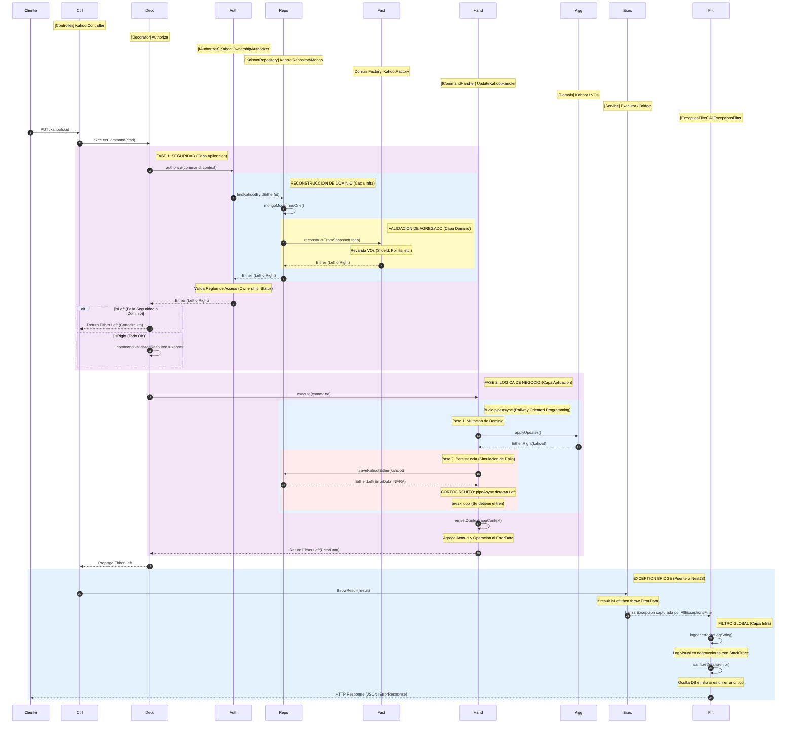

<p align="center">
  <a href="http://nestjs.com/" target="blank">
    
  </a>
</p>

# Kahoot Clone Backend - NestJS 🚀

## Configuración del Proyecto 🛠️

```bash
yarn install
```

## Compilar y ejecutar en modo desarrollador 🧠

### Configurar Variables de Entorno
1. Crea una copia del archivo `.env.template` y renómbralo a `.env`.
2. Configura las variables para establecer la conexión con la base de datos elegida (PostgreSQL o MongoDB).
3. Importante: Si utilizas un cluster de MongoDB Atlas, coloca la URL en la variable `MONGO_CNN`.

### Levantar Bases de Datos (Docker)

**PostgreSQL**
```bash
docker compose -f docker-compose.dev.postgres.yaml up -d
```

**MongoDB**
```bash
docker compose -f docker-compose.dev.mongo.yaml up -d
```

### Ejecutar el Proyecto

```bash
# development mode (watch)
yarn run start:dev

# production mode
yarn start:prod
```

## 🚀 Ejecución del Backend con Docker Compose

1. Configurar entorno:
   - `MONGO_HOST=mongo`
   - `DB_HOST=postgres`

2. Levantar servicios:

**MongoDB**
```bash
docker compose -f docker-compose.local.mongo.yaml up -d
```

**PostgreSQL**
```bash
docker compose -f docker-compose.local.postgres.yaml up -d
```

3. Acceso:
- HTTP API: http://localhost:3000/api
- WebSockets: ws://localhost:3000/multiplayer-sessions

## 🪛 Correr Tests

```bash
yarn run test        # Unit tests
yarn run test:e2e    # E2E tests
yarn run test:cov    # Coverage
```

## 🏗️ Arquitectura y Diseño

El backend está estructurado siguiendo Arquitectura Hexagonal (Ports & Adapters) y Domain-Driven Design (DDD).
Cada módulo representa su propio hexágono, fomentando la separación de responsabilidades.

---

### 🗺️ Modelo de Dominio

Para una comprensión visual profunda de las entidades, agregados y sus relaciones, disponemos de una representación gráfica detallada:

> [!TIP]
> 🎨 **[Acceder al Diagrama del Modelo de Dominio](https://lucid.app/lucidchart/ece44902-e188-405b-98a2-99114bfce612/edit?invitationId=inv_5ebb1b27-3046-48d7-bb6f-ddbeccdac5bc&page=5WW8gG8tv4Q4#)**
> _Plataforma: LucidChart_

---


### Estructura de Capas por Módulo

🟡 Domain (Núcleo)
- entities
- value-objects
- aggregates
- domain-services
- repositories 

🟣 Application
- command
- query
- application-services
- dtos

🔵 Infrastructure
- nest-js (controllers, gateways)
- external-services
- repositories (Mongoose / TypeORM)

## 🚨 Arquitectura de Errores y Flujo ROP

### 1. Objeto ErrorData
- errorId único para trazabilidad
- acumulación progresiva de contexto técnico y de negocio
- sanitización automática de errores de infraestructura

### 2. Either<L, R> y pipeAsync
- Left: ErrorData (fallo)
- Right: Resultado exitoso
- Short-circuit: el flujo se detiene al primer error
---
### 📌 DIAGRAMA DE SECUENCIA (ERRORES / ROP)

> El siguiente diagrama describe el flujo completo de ejecución, incluyendo el manejo de errores mediante Railway Oriented Programming.

---




### 🔗 RECURSOS EXTERNOS PARA LOS ERRORES
Para una experiencia visual mejorada y acceso a la edición del diagrama, utiliza el siguiente enlace:

> 🎨 **[Acceder al Diagrama en Eraser.io](https://app.eraser.io/workspace/w9byiD8Kuq4CRJ47rOU8?origin=share)**

---

## 📁 Guía de Directorios


### ⚛️ src/core

| Capa | Responsabilidad |
| :--- | :--- |
| **`domain/`** | **Núcleo de Negocio**: Abstracciones base (`AggregateRoot`, `Entity`, `ValueObject`), Eventos de Dominio y objetos de valor compartidos (IDs, fechas, puntos). |
| **`application/`** | **Puertos y Orquestación**: Definición de contratos (`ports`), lógica de seguridad (`auth`), decoradores de autorización y la interfaz del Bus de CQRS. |
| **`infrastructure/`** | **Implementaciones Técnicas**: Adaptadores reales para criptografía, generación de IDs (UUID), y la implementación física de los buses (Memory/Pino). |
| **`errors/`** | **Gestión de Fallos (ROP)**: Sistema centralizado de errores con factorías, contextos y el `pipe-async` para composición de flujos. |
| **`types/`** | **Tipado Funcional**: Tipos base para el control de flujo como `Either.ts` (éxito/error) y `Optional.ts`. |
| **`nest-js/`** | **Integración**: Decoradores y controladores base específicos para el ciclo de vida de NestJS. |

### 🧩 Anatomía de un Módulo (`src/[modulo]`)

Cada módulo sigue su propio hexágono, asegurando que la lógica de negocio no dependa de la tecnología externa.

| Capa | Contenido | Objetivo |
| :--- | :--- | :--- |
| **`domain/`** | Entidades, Agregados, Repositorios (Interfaces) | Definir las reglas de negocio puras del módulo. |
| **`application/`** | Casos de Uso, Command/Query Handlers, DTOs | Orquestar la lógica y transformar datos de entrada. |
| **`infrastructure/`** | Controladores, Adaptadores de BD, Mappers | Implementar la comunicación con el mundo exterior. |

---

### 🗄️ Capa de Datos (`src/database`)

Diseñada para ser agnóstica al motor de persistencia, permitiendo alta escalabilidad y flexibilidad.

| Componente | Funcionalidad |
| :--- | :--- |
| **Configuración** | Gestión de conexiones para **TypeORM** y **Mongoose**. |
| **Intercambio Dinámico** | Capacidad de conmutar entre motores de BD (SQL/NoSQL) según el entorno o necesidad. |
| **Patrón Repositorio** | Implementaciones concretas que desacoplan el dominio de la base de datos elegida. |

---
## ⚖️ License

This project is licensed under the MIT License - see the [LICENSE](LICENSE) file for details.

Copyright (c) 2025 Gustavo Kufatty, Luis Monroy, Luis Ochoa, Franklin Quintana, Sergio Rodríguez, Santiago Silva.
